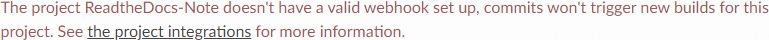

常见问题总结
============

*   手动导入的项目, 提示"The project xxx doesn't have a valid webhook set up ...."

手动导入的项目，提示类似下图所示的错误:

出现该问题的原因和解决方法见: https://docs.readthedocs.io/en/latest/webhooks.html#webhook-creation

简要来说，如果项目是从Read the Docs连接的账户的版本控制仓库导入的, 导入项目时会自动设置webhook, 当版本控制仓库有新的push时, Read the Docs会自动重现构建项目并发布;
但如果不是从连接的账户导入的项目, 就需要我们手动的设置webhook.

*   构建时提示如下错误:

    .. error::

        Sphinx error:

        master file /home/docs/checkouts/readthedocs.org/user_builds/hoodie-test/checkouts/latest/contents.rst not found

解决方法:

    检查项目的souce/conf.py中是否有如下配置:
    
    .. code-block:: python

        # The master toctree document.
        master_doc = 'index'

    如果没有, 手动添加.

    .. note::

        如果mster_doc的名称不是index，填写其实际的名称即可.

