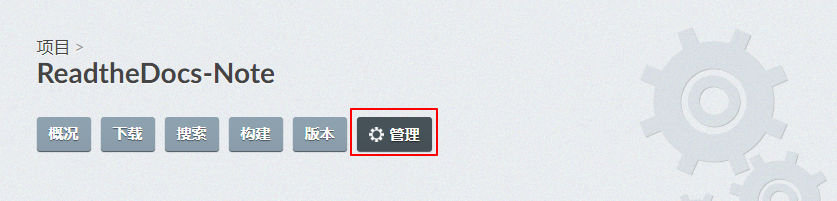
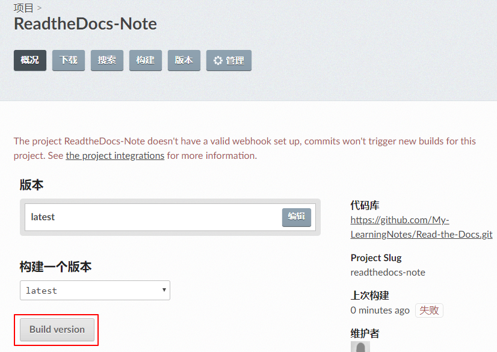

使用Read the Docs托管文档
=========================

`Read the Docs <https://readthedocs.org/>`__\ 是一个在线文档托管服务, 可以从GitHub/Bitbucket/GitLab中导入文档项目, 
如果使用webhooks, 那么每次提交代码后可以自动构建并上传至Read the Docs网站, 这样既有版本控制的好处, 又能自动发布到Read the Docs上面, 非常方便.

在Read the Docs上导入在GitHub上托管的文档项目非常简单, 参考\ `官方文档 <https://github.com/rtfd/readthedocs.org>`__\ :

-  Create an account on *Read the Docs*\ .
-  Log in and click on "Import a Project".
-  Click "Connect to GitHub" in order to connect your account's repositories to GitHub.
-  When prompted on GitHub, give access to you accout.
-  Click "Import a Repository" and select any desired repository.
-  Change any information if desired and click "Next".
-  All Done. Commit away and your project will auto-update.

在导入项目之后, 可以在\ **管理**\ 中对项目进行设置:

点击\ **概况/Build version**\ 主动触发构建:

